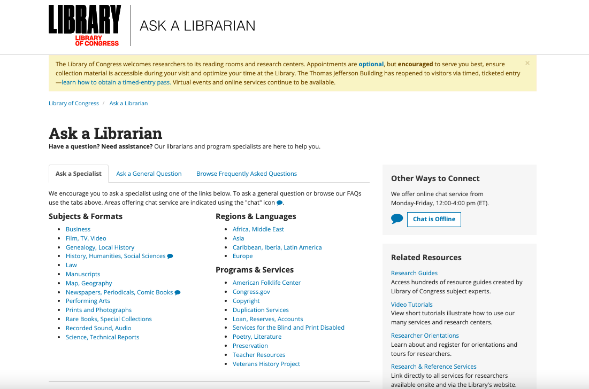
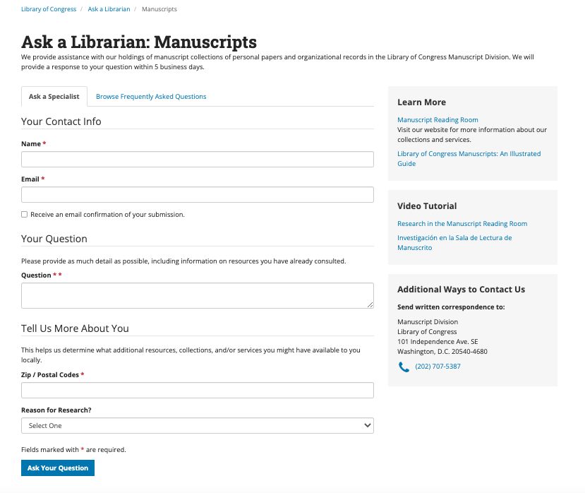
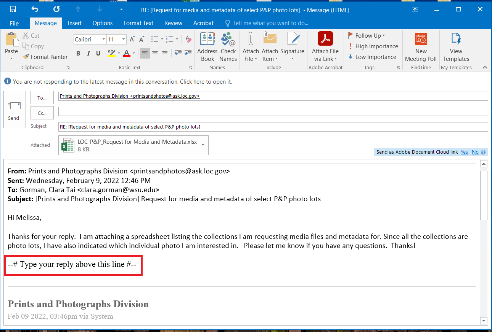

# The Library of Congress (LOC) 

## Requesting Metadata and Media from the Library of Congress  

To request media files and/or corresponding metadata please follow these steps to connect with the LOC staff: 
1. Initial contact should be made through the Ask a Librarian service.  
2. From the landing page, you can direct your request towards a specific division by picking a subject and format in the “Ask a Specialist” tab. One exception is the American Folklife Center, which is listed under “Programs & Services.”  

 
For example, if you were to choose “Manuscripts” under “Subjects & Formats,” the form would look as follows:  

The Ask a Librarian forms for the 4 specific divisions collaborating on the Mukurtu Shared Project are listed below:  
- The American Folklife Center (AFC) 
  - https://ask.loc.gov/american-folklife    
- The Manuscripts Division (MSS) 
  - https://ask.loc.gov/manuscripts  
- The Prints & Photographs Division (P&P) 
  - https://ask.loc.gov/prints-photographs/    
- The Geography & Maps Division (G&M) 
  - https://ask.loc.gov/map-geography  

3. Once you have selected the appropriate division, fill out the form with as much information as possible.  In the “Your Question” section be sure to include:  
   - The nature of the request (e.g., media and/or associated metadata).  
   - Brief description of your project (optional).   
   - Tribal affiliation, if any.   
   - Associations or collaborations you have with academic institutions or repositories.  
   - Questions about digitization or if you are interested in initiating a digitization request.  
   - If you have been working with a particular reference staff member or specialist, specify that you would like this request to be directed to that person.   

Be aware that there is no option to include attachments to this form. If you want to do so, that will be done in a follow-up email. 

4. Click “Ask Your Question” to submit the form.
   - Note that once the form is submitted, you will receive the following automated email response through the Ask-A-Librarian System: “Your recent question for the (specific) Division of the Library of Congress has been referred to a staff member for reply.” 

5. Wait for a response from a reference staff member (response times may vary).  

6. The response will come from the specific division through the Ask a Librarian service. Once you have received this, reply above the dotted line and attach your spreadsheet (or whatever form your tracking documentation is in) indicating the list of the materials you are requesting.  

 

7. Once you have submitted your full request, a reference staff member will be in touch with any follow-up questions or needs.  

8. You will receive your requested materials from the Library of Congress via email, which will contain a link to their file sharing system.   

*__Things To Keep in Mind:__ Be aware that if you are requesting media that is not digitized, there may or may not be accompanying metadata. If you are unsure if this is the case for your materials of interest, be sure to ask a reference staff.*
 
## Additional Resources  
- Duplication Services at the Library of Congress 
  - https://www.loc.gov/duplicationservices/  
- Products & Pricing – Duplication Services at the Library of Congress 
  - https://www.loc.gov/duplicationservices/products-pricing/   
    - Select tabs at the top to see pricing information for different material formats
